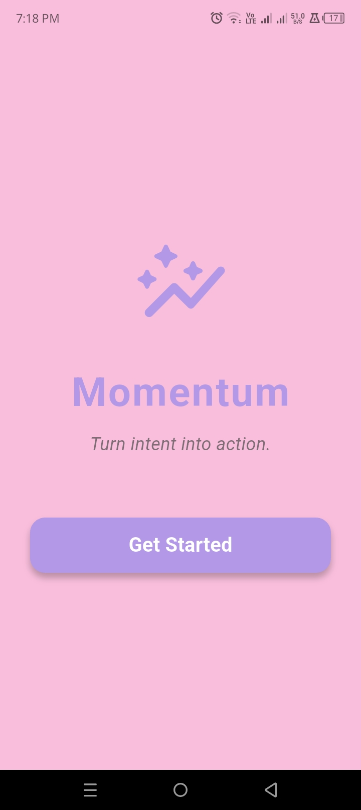
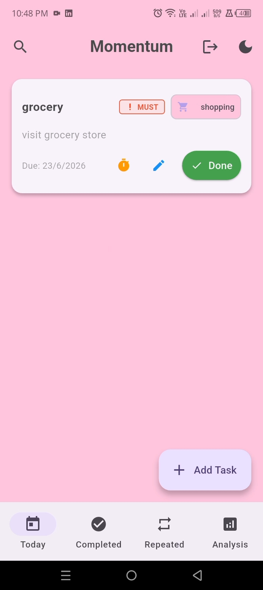
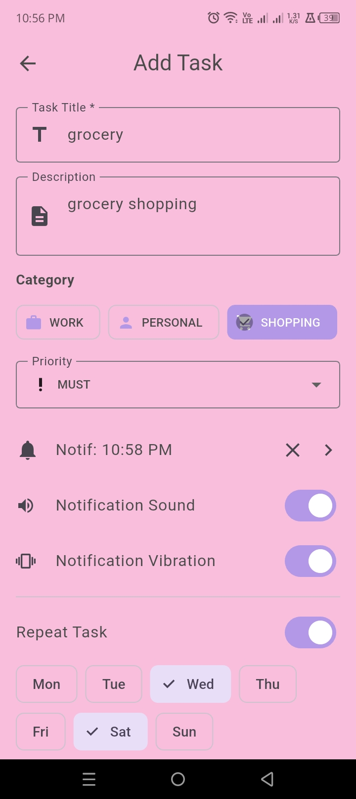
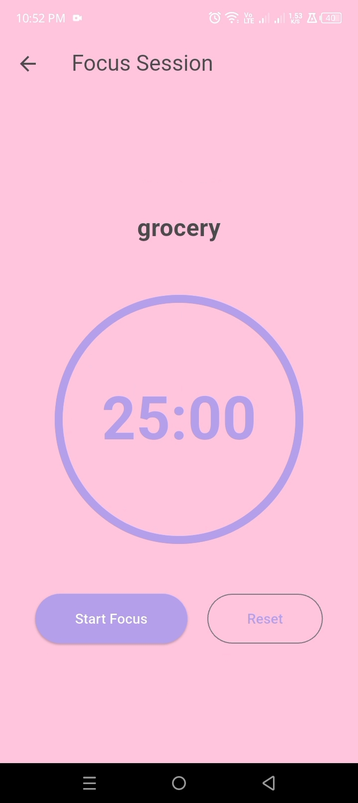
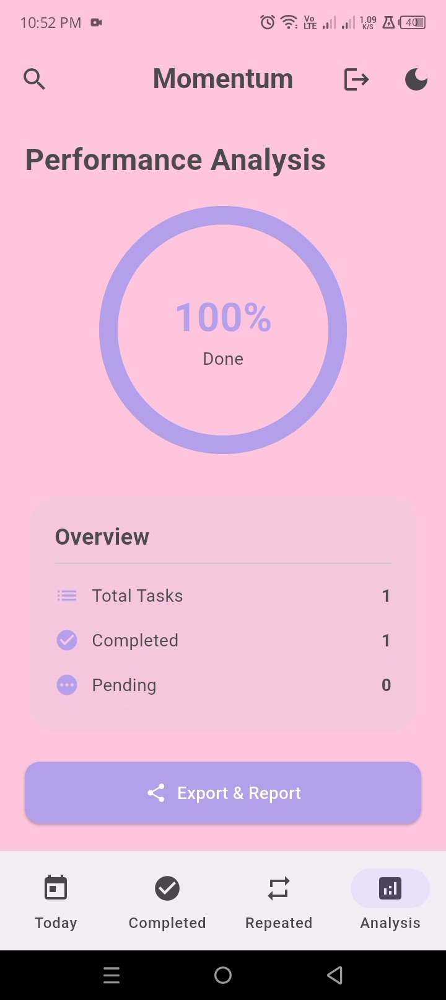
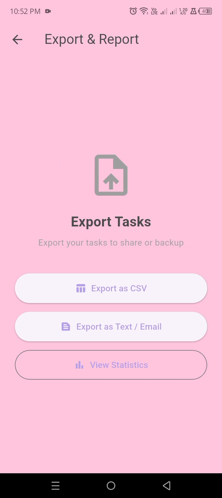
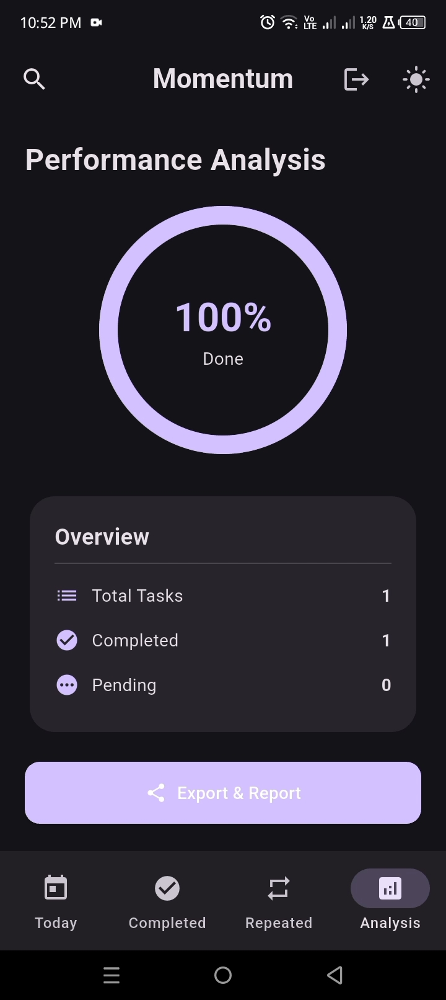
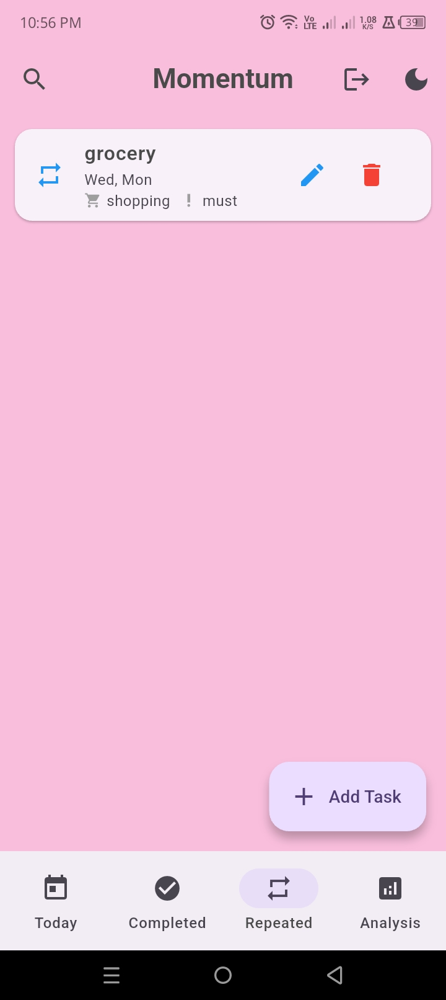

<div align="center">

# ⚡ Momentum — The Task Manager

**A beautifully designed, offline-first productivity app built with Flutter.**

Plan your day, build streaks, stay focused, and own your data — no account required, no cloud lock-in.

[](https://flutter.dev)
[](https://dart.dev)
[]()
[](LICENSE)
[](CONTRIBUTING.md)

[](https://github.com/zahra01-m/momentum-the-task-manager/stargazers)
[](https://github.com/zahra01-m/momentum-the-task-manager/network/members)
[](https://github.com/zahra01-m/momentum-the-task-manager/commits/main)
[](https://github.com/zahra01-m/momentum-the-task-manager/issues)

[Features](#-features) • [Screenshots](#-screenshots) • [Architecture](#-architecture) • [Getting Started](#-getting-started) • [Roadmap](#-roadmap) • [Contributing](#-contributing)

</div>

---

## 📌 About

**Momentum** is a full-featured, cross-platform task management app built entirely in Flutter. It goes beyond a basic to-do list — combining task scheduling, recurring habits, biometric-secured accounts, local notifications, a Pomodoro-style focus timer, productivity analytics, and CSV/PDF export, all running **fully offline** on a local SQLite database.

It was built to demonstrate production-grade Flutter architecture: clean separation of models, services, and providers, real device integrations (notifications, biometrics, file sharing), and a polished, theme-aware UI — not just a CRUD demo.

---

## ✨ Features

### ✅ Task Management
- Create, edit, delete, and complete tasks with titles, descriptions, due dates, and sub-tasks
- Priority levels (**Must / Should / Could / Won't** — MoSCoW method) and category tagging (Work, Personal, Shopping, Health, Education, Other)
- Swipe gestures for quick complete/delete actions
- Dedicated views for **Today's Tasks** and **Completed Tasks**

### 🔁 Recurring Tasks
- Set tasks to repeat on specific days of the week
- Automatic daily regeneration without duplicate clutter

### ⏱️ Focus Timer
- Built-in Pomodoro-style focus timer tied to individual tasks
- Tracks accumulated focus time per task

### 🔔 Smart Notifications
- Scheduled local reminders powered by `flutter_local_notifications` and timezone-aware scheduling
- Sound and vibration alerts for due tasks

### 🔐 Secure Accounts
- Local sign-up/login system backed by SQLite
- Optional **biometric authentication** (fingerprint/Face ID) via `local_auth` for quick, secure app access

### 📊 Analytics
- Visual breakdown of completed vs. pending tasks
- Productivity insights via `percent_indicator` charts

### 📤 Export & Backup
- Export your tasks to **CSV** or **PDF** for backup, reporting, or sharing
- One-tap sharing via the native share sheet (`share_plus`)

### 🎨 Polished UI/UX
- Custom light & dark themes with a soft, cohesive color palette
- Smooth entrance animations (`animate_do`)
- Material 3 design system throughout

---

## 📱 Screenshots

<div align="center">

| Welcome | Home | Add Task | Focus Timer |
|:---:|:---:|:---:|:---:|
|  |  |  |  |

| Analytics | Export | Dark Mode | Repeated Tasks |
|:---:|:---:|:---:|:---:|
|  |  |  |  |

*Replace the placeholders above with real screenshots — drop your images into a `/screenshots` folder in the repo root and update the filenames.*

</div>

> 🎥 A full demo walkthrough video is also available: `demo.mp4` (add to repo or link to YouTube/Drive).

---

## 🏗️ Architecture

Momentum follows a **layered, provider-based architecture** that keeps UI, business logic, and data access cleanly separated:

```
lib/
├── main.dart                     # App entry point, theming, root widget
│
├── models/                       # Plain Dart data models
│   ├── task_model.dart           # Task, SubTask, TaskCategory, TaskPriority
│   └── user_model.dart           # User account model
│
├── services/                     # Platform & data integrations
│   ├── database_service.dart     # SQLite (sqflite) CRUD — tasks & users
│   ├── notification_service.dart # Local, timezone-aware notifications
│   └── biometric_service.dart    # Fingerprint / Face ID auth (local_auth)
│
├── providers/                    # State management (ChangeNotifier)
│   └── task_provider.dart        # Single source of truth for task state
│
├── screens/                      # Feature-level UI screens
│   ├── welcome_screen.dart
│   ├── login_screen.dart / signup_screen.dart
│   ├── home_screen.dart
│   ├── today_tasks_screen.dart
│   ├── completed_tasks_screen.dart
│   ├── repeated_tasks_screen.dart
│   ├── add_edit_task_screen.dart
│   ├── focus_timer_screen.dart
│   ├── analysis_screen.dart
│   └── export_screen.dart
│
└── widgets/                      # Reusable UI components
    ├── confirmation_dialog.dart
    └── task_search_delegate.dart
```

**Data flow:** `Screens` dispatch actions → `TaskProvider` (Provider / ChangeNotifier) updates in-memory state and calls → `DatabaseService` persists to SQLite → `TaskProvider` notifies listeners → `Screens` rebuild reactively.

### Tech Stack

| Layer | Technology |
|---|---|
| Framework | Flutter (Dart 3.x) |
| State Management | `provider` |
| Local Database | `sqflite` (SQLite) |
| Notifications | `flutter_local_notifications`, `timezone` |
| Authentication | `local_auth` (biometrics), local SQLite auth |
| Export | `csv`, `pdf`, `path_provider`, `share_plus` |
| Preferences | `shared_preferences` |
| UI/Animation | `animate_do`, `percent_indicator`, `flutter_slidable` |
| Utilities | `uuid`, `intl`, `url_launcher` |

---

## 🚀 Getting Started

### Prerequisites

- [Flutter SDK](https://docs.flutter.dev/get-started/install) `>= 3.0.0`
- Dart `>= 3.0.0` (bundled with Flutter)
- Android Studio / Xcode (for mobile builds) or a configured desktop toolchain
- A connected device or emulator/simulator

### Installation

```bash
# 1. Clone the repository
git clone https://github.com/zahra01-m/momentum-the-task-manager.git
cd momentum-the-task-manager

# 2. Install dependencies
flutter pub get

# 3. Run the app
flutter run
```

### Build for release

```bash
# Android APK
flutter build apk --release

# iOS
flutter build ios --release

# Windows / macOS / Linux
flutter build windows   # or macos / linux

# Web
flutter build web
```

### Running tests

```bash
flutter test
```

---

## 🗺️ Roadmap

- [ ] Cloud sync (Firebase) with optional multi-device support
- [ ] Widget/home-screen shortcuts for quick task add
- [ ] Recurring task templates and smart suggestions
- [ ] Collaborative/shared task lists
- [ ] Localization (multi-language support)
- [ ] Automated CI (GitHub Actions) for build & test on every PR

Have an idea? [Open an issue](https://github.com/zahra01-m/momentum-the-task-manager/issues) or start a discussion!

---

## 🤝 Contributing

Contributions, issues, and feature requests are welcome!

1. Fork the project
2. Create your feature branch (`git checkout -b feature/amazing-feature`)
3. Commit your changes (`git commit -m 'Add some amazing feature'`)
4. Push to the branch (`git push origin feature/amazing-feature`)
5. Open a Pull Request

Please make sure `flutter analyze` and `flutter test` pass before submitting.

---

## 📄 License

This project is licensed under the **MIT License** — see the [LICENSE](LICENSE) file for details.

---

## 👩‍💻 Author

**Zahra Mushtaq**
Flutter Developer | BS Computer Science, COMSATS University Islamabad

- GitHub: [@zahra01-m](https://github.com/zahra01-m)
- LinkedIn: [zahra-mushtaq-](https://www.linkedin.com/in/zahra-mushtaq-)

<div align="center">

If you found this project useful, consider giving it a ⭐ — it helps a lot!

</div>
